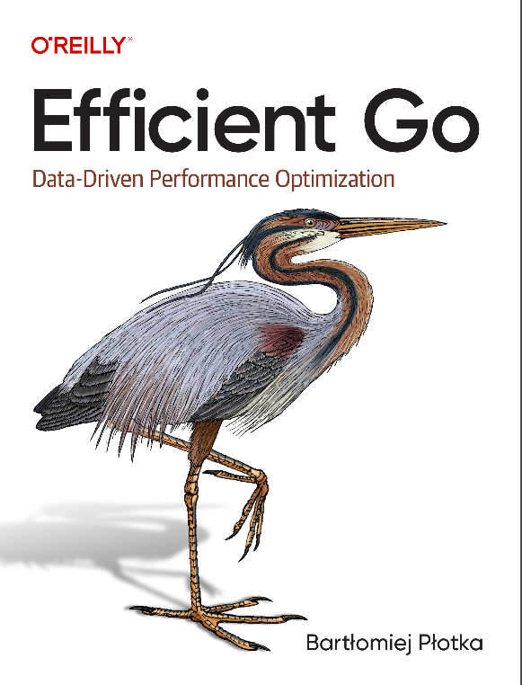

# "Efficient Go" Book Code Examples

Hi 👋

My name is [Bartek Płotka](https://www.bwplotka.dev) and I wrote ["Efficient Go"](https://www.bwplotka.dev/book). This book teaches pragmatic approaches to software efficiency and optimizations. While the majority of the learnings works for any programming language, it's best to learn on specific examples. For that purpose I teach how to make my favorite language more efficient - [Go](https://go.dev).

In this open-source repository you can find all examples from the book with tests, additional comments and more! Play with the examples to learn more about CPU, memory, OS and Go runtime characteristics I explained in my book! 

> NOTE: Don't import this module to your production code--it is meant for learning purposes only. Instead, we maintain production grade utilities mentioned in the book in [core](https://github.com/efficientgo/core) and [e2e](https://github.com/efficientgo/e2e) modules.

## Index of Examples From Book
                                                                                                     
All examples from the book are buildable and tested in CI (as they should). See their location in the below table. For most of the code there exists corresponding `_test.go` file with tests and microbenchmark when relevant.

> NOTE: Some function names in examples might be different in book vs in code, due to name clashes.     

> NOTE: I use non-conventional naming convention with some functions e.g. `FailureRatio_Better`. In Go all names
> should have camelCase form, so e.g. `FailureRatioBetter`. However, I chose to keep underscore to separate different versions
> of the same functions for book purposes - so the "production name" should is still `FailureRatio`! (: 

| Example Ref | Page | Path to code/function in this repository.                                     |
|-------------|------|-------------------------------------------------------------------------------|
| Example 1-1 | 9    | [pkg/getter/getter.go:13 `FailureRatio`](pkg/getter/getter.go)                |
| Example 1-2 | 10   | [pkg/getter/getter.go:29 `FailureRatio_Better`](pkg/getter/getter.go)         |
| Example 1-3 | 12   | [pkg/prealloc/slice.go:5 `createSlice`](pkg/prealloc/slice.go)                |
| Example 1-4 | 12   | [pkg/prealloc/slice.go:14 `createSlice_Better`](pkg/prealloc/slice.go)        |
| Example 1-5 | 13   | [pkg/notationhungarian/hung.go:5 `structSystem`](pkg/notationhungarian/hung.go) |
|   Example 2-1          | 37   | [pkg/basic/basic.go:6](pkg/basic/basic.go)                                    |
|             |      |                                                                               |
|             |      |                                                                               |
|             |      |                                                                               |

